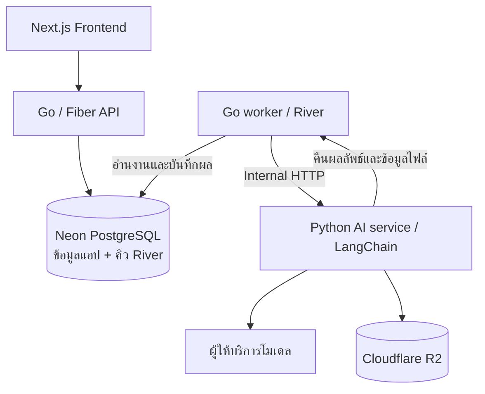

# Book Fantasy

โปรเจกต์เว็บสมุดบันทึกสัตว์อสูรในบรรยากาศ **dark fantasy** ผู้ใช้สามารถนำไอเดียของตัวเองมาสร้างภาพและร่างตำนานด้วย AI เก็บเป็นสมุดส่วนตัว และเลือกเผยแพร่ผลงานในแกลเลอรีร่วมกัน

เอกสารนี้อธิบายแนวทางและโครงสร้างโฟลเดอร์ที่ตกลงกัน เพื่อใช้เป็นพื้นฐานในการออกแบบระบบต่อไป

> **สถานะปัจจุบัน: มีโครงสร้างโฟลเดอร์ เอกสาร และ GitHub Actions สำหรับเชื่อมสถานะ Linear ทีม BOO และแจ้ง Discord**
>
> ยังไม่ได้เขียนโค้ด frontend, backend หรือ AI service ไม่มีการเชื่อมต่อฐานข้อมูล ไม่มีการตั้งค่า authentication, queue, storage หรือ Docker และยังไม่ได้ออกแบบรายละเอียด API หรือ database schema
>
> เทคโนโลยีและ flow ในเอกสารเป็นแนวทางที่เลือกไว้ ไม่ใช่ฟีเจอร์ที่ implement หรือทดสอบแล้ว

Flow การทำงาน: เปิด PR เข้า `dev` → `In Review`, merge เข้า `dev` → `QA`, แล้ว merge `dev → main` ด้วย merge commit → แจ้ง Discord โดยคงสถานะ Linear เดิม
ดู [คู่มือ Linear และ Discord](.github/LINEAR.md) สำหรับตั้ง `LINEAR_HORN_PROD_BOOK`, `DISCORD_WEBHOOK_URL` โดยติดตั้ง workflow เข้า `dev` ก่อน แล้วค่อยนำ `dev` เข้า `main` เมื่อพร้อม

## 1. แนวคิดของโปรเจกต์

ประสบการณ์ใช้งานที่ต้องการพัฒนาในอนาคต:

1. ผู้ใช้เข้าสู่ระบบและมีสมุดบันทึกของตัวเอง
2. ผู้ใช้เขียน prompt อธิบายสัตว์อสูรหรือสิ่งมีชีวิตในจินตนาการ
3. AI สร้างภาพพร้อมร่างชื่อ คำบรรยาย และตำนาน
4. ผู้ใช้ปรับข้อความและเก็บผลงานไว้ในสมุด
5. ผู้ใช้เลือกเผยแพร่ผลงานให้คนอื่นดูผ่านแกลเลอรี

แต่ละคนมีโลกและเรื่องราวของตัวเอง โดยใช้บรรยากาศ dark fantasy ร่วมกัน ไม่ได้กำหนดให้สัตว์ทุกตัวอยู่ในจักรวาลหรือตำนานหลักเดียวกัน

เป้าหมายช่วงแรกคือกลุ่มทดลองขนาดเล็ก พร้อมใช้โปรเจกต์นี้เรียนรู้ Go และการจัดระบบ AI งบที่ตั้งไว้สำหรับช่วงทดลองคือไม่เกิน **1,000 บาทต่อเดือน** ซึ่งยังต้องประเมินจากบริการและการใช้งานจริง

## 2. Technology stack ที่ตกลงกัน

| ส่วน | เทคโนโลยี | หน้าที่ที่วางไว้ |
| --- | --- | --- |
| Frontend | Next.js + TypeScript | หน้าสมุด หน้าสร้างสัตว์อสูร และแกลเลอรี |
| Styling | Tailwind CSS | ธีมและองค์ประกอบ dark fantasy |
| Backend | Go + Fiber | API สมาชิก สิทธิ์เข้าถึง สมุด ผลงาน และโควตา |
| Authentication | Google Sign-in + session ฝั่ง Go | เข้าสู่ระบบและตรวจสิทธิ์ |
| Database | PostgreSQL บน Neon | ข้อมูลผู้ใช้ สมุด ผลงาน สถานะงาน และคิว River |
| Storage | Cloudflare R2 | ภาพต้นฉบับและภาพย่อ |
| AI service | Python + LangChain | ตรวจ prompt จัดรูปแบบข้อมูล ประกอบ prompt เรียกโมเดล และตรวจผลลัพธ์ |
| Background jobs | River + Go worker | รับงานจากคิว เรียก Python และบันทึกสถานะกับผลลัพธ์ |
| Development | GitHub + Docker Compose | เก็บโค้ดและจัดสภาพแวดล้อมสำหรับรันบริการร่วมกัน |

ยังไม่กำหนดเวอร์ชัน dependency, ผู้ให้บริการโมเดลจริง หรือผู้ให้บริการ hosting และยังไม่มีไฟล์ติดตั้งหรือตั้งค่าของ stack นี้

## 3. รูปแบบสถาปัตยกรรม

ใช้ **Monorepo + Modular Monolith ฝั่ง Go + Python AI service แยกต่างหาก**

- **Monorepo:** เก็บ frontend, backend, AI service และเอกสารไว้ใน repository เดียวกัน
- **Modular Monolith:** แบ่งงานหลักของ Go เป็นโมดูลตามฟีเจอร์ โดยใช้ Go codebase ร่วมกัน
- **API และ worker:** มีจุดเริ่มต้นโปรแกรมแยกกัน สามารถรันเป็นคนละ process แต่ยังใช้โมดูลธุรกิจร่วมกันได้
- **Python AI service:** แยกออกมาเพื่อดูแลกระบวนการ AI และ dependency ของ Python โดยเฉพาะ

ทั้งระบบจึงไม่ใช่ monolith ล้วน และไม่ได้แตก Auth, Books, Entries หรือ Gallery เป็น microservices แยกกัน

### ภาพรวมการเชื่อมต่อที่วางไว้



Go API จะรับคำขอและเพิ่มงานลงคิว ส่วน Go worker เป็นผู้รับงานจาก River แล้วเรียก Python ผ่าน internal HTTP API เมื่อ Python ประมวลผลเสร็จ จะส่งผลลัพธ์และข้อมูลไฟล์กลับให้ worker บันทึกลงฐานข้อมูล

Python ไม่อ่านคิว River โดยตรง และ frontend ไม่เรียก Python หรือฐานข้อมูลโดยตรง รายละเอียดสัญญาข้อมูล วิธีจัดการงานซ้ำ และการรับมือ timeout ยังต้องออกแบบก่อน implement

ระยะแรกยังไม่เพิ่ม Redis หรือ NATS เพราะวางให้ River ดูแลคิวงานอยู่แล้ว หากมีความจำเป็นจากการใช้งานจริงจึงค่อยพิจารณาเพิ่ม

## 4. โครงสร้างโฟลเดอร์ปัจจุบัน

โฟลเดอร์ด้านล่างสร้างไว้แล้ว ส่วนแอปและบริการยังไม่มี implementation; `.github/` มี workflow และสคริปต์เชื่อม Linear

```text
book_fantasy/
├── apps/
│   └── web/
│       └── src/
│           ├── app/
│           ├── features/
│           │   ├── auth/
│           │   ├── books/
│           │   ├── entries/
│           │   ├── gallery/
│           │   └── generation/
│           ├── components/
│           │   └── ui/
│           └── lib/
│
├── services/
│   ├── backend/
│   │   ├── cmd/
│   │   │   ├── api/
│   │   │   └── worker/
│   │   ├── internal/
│   │   │   ├── auth/
│   │   │   ├── books/
│   │   │   ├── entries/
│   │   │   ├── gallery/
│   │   │   ├── generation/
│   │   │   └── platform/
│   │   └── db/
│   │       ├── migrations/
│   │       └── queries/
│   │
│   └── ai/
│       ├── src/
│       │   └── ai_service/
│       │       ├── api/
│       │       ├── schemas/
│       │       ├── pipelines/
│       │       ├── guardrails/
│       │       ├── prompts/
│       │       └── providers/
│       └── tests/
│
├── contracts/
├── tests/
│   └── e2e/
├── infra/
│   └── docker/
├── docs/
│   └── decisions/
├── .github/
│   ├── workflows/
│   ├── scripts/
│   └── LINEAR.md
└── README.md
```

## 5. หน้าที่ของแต่ละส่วน

### Frontend — `apps/web/`

จัดโค้ดตามฟีเจอร์ เพื่อให้ UI ที่เกี่ยวข้องกับเรื่องเดียวกันอยู่ใกล้กัน

| โฟลเดอร์ | หน้าที่ที่เตรียมไว้ |
| --- | --- |
| `src/app/` | Routes, pages และ layouts ของ Next.js โดยนำแต่ละ feature มาประกอบเป็นหน้า |
| `src/features/auth/` | UI การเข้าสู่ระบบและสถานะผู้ใช้ |
| `src/features/books/` | UI สมุดส่วนตัวและการจัดการสมุด |
| `src/features/entries/` | UI หน้าบันทึกสัตว์อสูร การอ่านและแก้ไขผลงาน |
| `src/features/gallery/` | UI แสดงผลงานที่เผยแพร่ |
| `src/features/generation/` | ฟอร์ม prompt และการแสดงสถานะงานสร้างภาพ |
| `src/components/ui/` | UI พื้นฐานที่หลาย feature ใช้ร่วมกัน เช่น ปุ่ม ช่องกรอก และ dialog |
| `src/lib/` | เครื่องมือร่วมของ frontend เช่น API client และตัวช่วยจัดรูปแบบข้อมูล |

Frontend รับผิดชอบการแสดงผลและการโต้ตอบกับผู้ใช้ ส่วนสิทธิ์เข้าถึง ความเป็นเจ้าของผลงาน และโควตาต้องให้ Go ตรวจสอบ

### Backend — `services/backend/`

เตรียมเป็น Go module เดียว โดยแยกโมดูลธุรกิจอยู่ใต้ `internal/`

| โฟลเดอร์ | หน้าที่ที่เตรียมไว้ |
| --- | --- |
| `cmd/api/` | จุดเริ่มต้นโปรแกรม Go/Fiber API |
| `cmd/worker/` | จุดเริ่มต้นโปรแกรม Go worker สำหรับ River |
| `internal/auth/` | Google Sign-in, session และข้อมูลตัวตนของผู้เรียก |
| `internal/books/` | กติกาและการจัดการสมุด รวมถึงความเป็นเจ้าของ |
| `internal/entries/` | กติกาการจัดการบันทึกสัตว์อสูรและการเผยแพร่ |
| `internal/gallery/` | การอ่านและแสดงรายการผลงานที่เผยแพร่แล้ว |
| `internal/generation/` | การจัดการคำขอสร้างผลงาน โควตา สถานะงาน และการประสานงานกับ AI |
| `internal/platform/` | โครงสร้างพื้นฐานร่วม เช่น config, database connection, logging และ service clients |
| `db/migrations/` | ไฟล์เปลี่ยนแปลงโครงสร้างฐานข้อมูลเมื่อเริ่มออกแบบ schema |
| `db/queries/` | SQL queries ที่ใช้ใน backend เมื่อเริ่ม implement |

แนวทางภายในแต่ละโมดูลคือแยกการรับ HTTP, กติกาธุรกิจ และการเข้าถึงข้อมูลตามความจำเป็น โดยยังไม่สร้างไฟล์หรือกำหนด interface รายละเอียดในขั้นนี้

`platform/` มีไว้สำหรับงานโครงสร้างพื้นฐาน ส่วนกติกาของแต่ละฟีเจอร์ควรอยู่ในโมดูลที่เป็นเจ้าของเรื่องนั้น

### AI service — `services/ai/`

เตรียมสำหรับ Python และ LangChain โดยแยกส่วนรับคำขอ ลำดับงาน และการเชื่อมผู้ให้บริการออกจากกัน

| โฟลเดอร์ | หน้าที่ที่เตรียมไว้ |
| --- | --- |
| `src/ai_service/api/` | Internal HTTP endpoints ที่ Go worker เรียกใช้ |
| `src/ai_service/schemas/` | รูปแบบและการตรวจข้อมูลเข้า/ออกของ AI service |
| `src/ai_service/pipelines/` | ลำดับการทำงาน เช่น ตรวจ input ประกอบ prompt สร้างภาพ และตรวจ output |
| `src/ai_service/guardrails/` | การตรวจเนื้อหาและข้อมูลตามกติกาที่จะออกแบบสำหรับเว็บ |
| `src/ai_service/prompts/` | Prompt templates และ style presets ที่ระบบควบคุม |
| `src/ai_service/providers/` | ส่วนเชื่อมผู้ให้บริการโมเดลและ storage เช่น R2 |
| `tests/` | การทดสอบภายใน AI service เมื่อมี implementation |

AI service รับผิดชอบกระบวนการสร้างผลงาน แต่ไม่ตัดสินสิทธิ์ผู้ใช้หรือแก้ไขโควตาเอง และไม่แก้ข้อมูลสมุดในฐานข้อมูลโดยตรง

LangChain เป็นเครื่องมือจัดกระบวนการ AI ไม่ใช่ระบบป้องกัน prompt injection แบบอัตโนมัติ รายละเอียดการตรวจเนื้อหาและขอบเขตสิทธิ์ของโมเดลยังต้องออกแบบและทดสอบ

### ส่วนกลางของ repository

| โฟลเดอร์ | หน้าที่ที่เตรียมไว้ |
| --- | --- |
| `contracts/` | สัญญาข้อมูลและ API ระหว่าง Next.js ↔ Go และ Go ↔ Python |
| `tests/e2e/` | การทดสอบ flow ที่เชื่อมหลายส่วนของระบบเข้าด้วยกัน |
| `infra/docker/` | Dockerfiles และไฟล์ประกอบการรัน container ในอนาคต |
| `docs/` | เอกสารการออกแบบและแนวทางพัฒนา |
| `docs/decisions/` | บันทึกการตัดสินใจด้านสถาปัตยกรรม พร้อมเหตุผลและข้อแลกเปลี่ยน |
| `.github/workflows/` | GitHub Actions เชื่อมสถานะ Linear จาก PR; การตั้งค่าอยู่ใน `.github/LINEAR.md` |

`contracts/` ใช้กำหนดสิ่งที่แต่ละบริการตกลงรับและส่ง ไม่ใช่ที่รวม business logic ข้ามภาษา ส่วนเอกสารใน `docs/decisions/` ควรบันทึกเฉพาะการตัดสินใจที่ตกลงแล้ว และแยกข้อเสนอที่ยังหารือออกให้ชัดเจน

## 6. ขอบเขตความรับผิดชอบ

| ส่วน | เป็นเจ้าของเรื่องใด |
| --- | --- |
| Next.js | UI, forms, navigation และสถานะบนหน้าจอ |
| Go API / โมดูลธุรกิจ | ตัวตนผู้ใช้ สิทธิ์ ข้อมูลสมุด ผลงาน โควตา และกติกาของแอป |
| Go worker | รับงานจากคิว เรียก AI service และประสานการบันทึกสถานะกับผลลัพธ์ |
| Python AI service | กระบวนการ AI, prompts, การตรวจเนื้อหา และการเชื่อมโมเดล |
| Neon PostgreSQL | จัดเก็บข้อมูลที่ backend ดูแล รวมถึงคิวงาน |
| Cloudflare R2 | จัดเก็บไฟล์ภาพ โดยสิทธิ์เข้าถึงต้องสัมพันธ์กับข้อมูลเจ้าของผลงานใน backend |

รูปแบบนี้ช่วยให้ปรับ AI pipeline ได้โดยไม่ย้ายกติกาสมาชิกหรือสมุดไปอยู่ฝั่ง Python และช่วยให้ API กับ worker ใช้กติกาเดียวกันจาก Go codebase

## 7. เรื่องที่ยังต้องออกแบบก่อนเขียนโค้ด

- หน้าจอและ user flow รวมถึงรูปแบบสมุด บันทึก และการเผยแพร่
- Database schema, ความสัมพันธ์ข้อมูล และรูปแบบ migrations
- Public API และสัญญาข้อมูลภายในระหว่าง Go กับ Python
- Google Sign-in, session และการตรวจสิทธิ์
- Job lifecycle, timeout, retry และการจัดการกรณีไม่ทราบว่าผู้ให้บริการสร้างภาพสำเร็จแล้วหรือไม่
- โควตา การบันทึกต้นทุน และการป้องกันการเรียกงานเสียเงินซ้ำ
- ผู้ให้บริการโมเดล คุณภาพภาพ และการคุมสไตล์
- กติกาเนื้อหา การป้องกัน prompt injection และการตรวจผลลัพธ์
- การจัดเก็บภาพ สิทธิ์เข้าถึง และการเผยแพร่ผ่าน R2
- Hosting, environments, secrets, CI/CD และแผนการทดสอบ

ยังไม่มีคำสั่งติดตั้ง รัน หรือทดสอบโปรเจกต์ เพราะขั้นปัจจุบันเป็นการเตรียมโครงสร้างโฟลเดอร์เท่านั้น

## 8. หมายเหตุเรื่อง Git

Git ไม่ติดตามโฟลเดอร์ว่าง จึงเพิ่มไฟล์ `.gitkeep` ในโฟลเดอร์ปลายทางที่ยังว่าง เพื่อให้โครงสร้างติดไปกับ repository เมื่อ commit และ push

`.gitkeep` เป็นไฟล์ว่างที่ใช้เป็น placeholder ตามธรรมเนียม ไม่ใช่โค้ดหรือ config และไม่มีความหมายพิเศษต่อ Git เมื่อโฟลเดอร์นั้นมีไฟล์ที่ใช้งานจริงและถูกติดตามใน Git แล้ว สามารถลบ `.gitkeep` ออกได้
